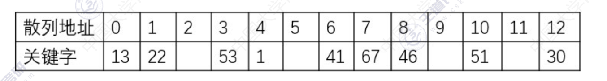

### 1
采用哈希函数H(k)=3*k mod 13 并用线性探测开放地址法处理冲突，在数列地址空间[0...12]中对关键字序列22,41,53,46,30,13,1,67,51
(1) 构造哈希表 画示意图

(2) 装填因子
散列表的地址空间大小为13，有9个关键字已经插入，因此装填因子=9/13

(3) 成功的平均查找长度
关键字22 脚标=(22*3) mod 13=1 查找长度=1
关键字41 脚标=(41*3) mod 13=6 查找长度=1
关键字53 脚标=(53*3) mod 13=3 查找长度=1
关键字46 脚标=(46*3) mod 13=8 查找长度=1
关键字30 脚标=(30*3) mod 13=12 查找长度=1
关键字13 脚标=(13*3) mod 13=0 查找长度=1
关键字1 脚标=(1*3) mod 13=3 查找长度=2
关键字67 脚标=(67*3) mod 13=6 查找长度=2
关键字51 脚标=(51*3) mod 13=10 查找长度=1

成功的平均查找长度ASL成功=(1*7+2*2)/9=11/9

(4) 不成功的平均查找长度

失败的平均查找长度ASL失败=(3+2+1+3+2+1+4+3+2+1+2+1+4)/13=29/13
