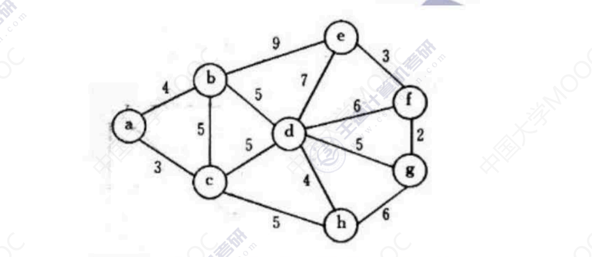
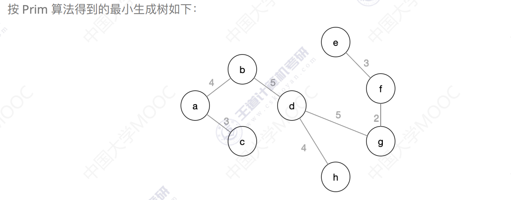
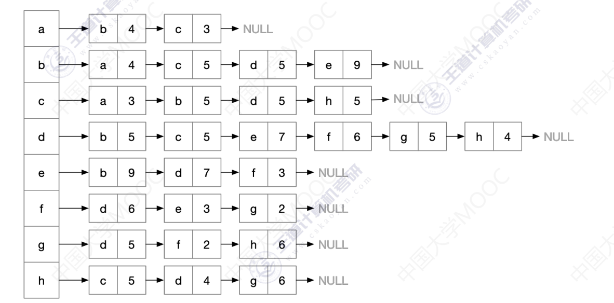
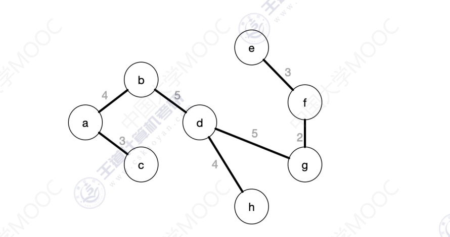
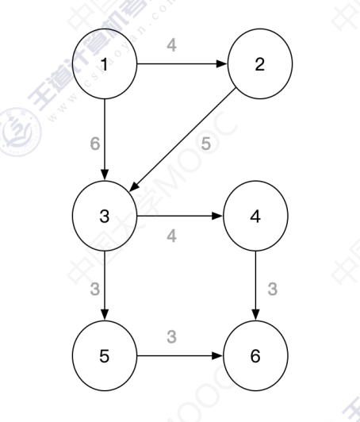
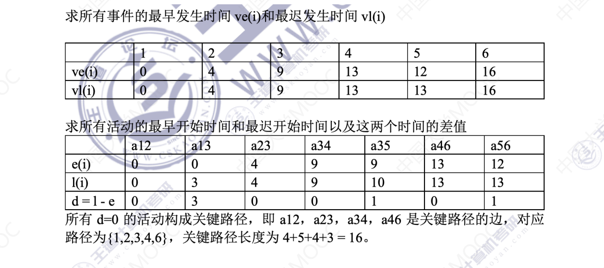
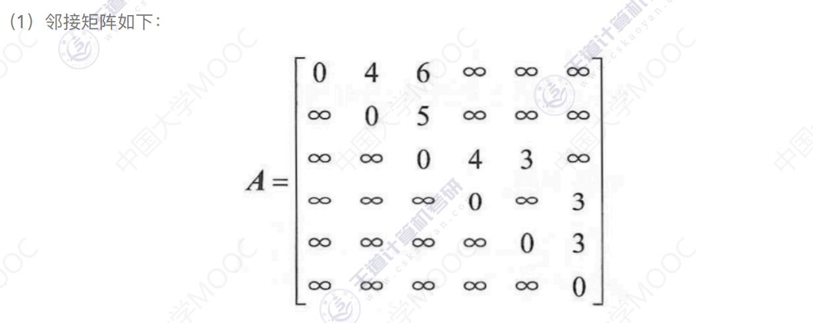
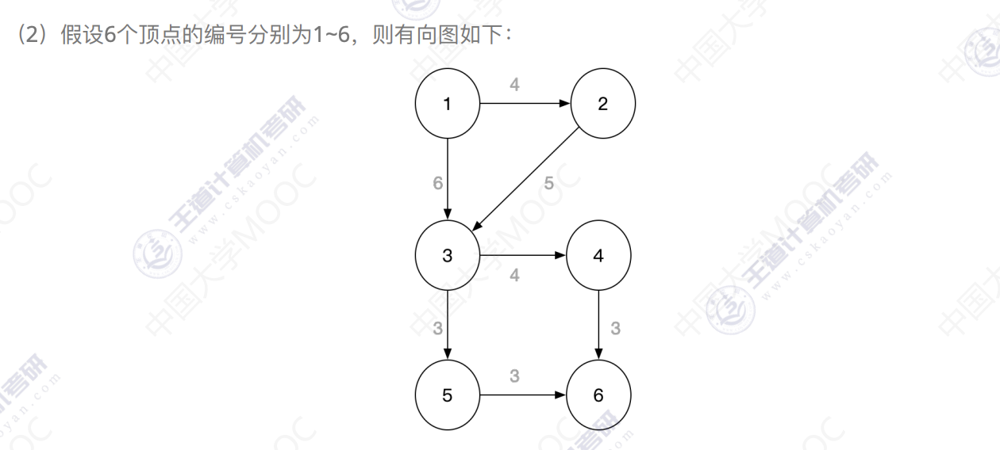

### 1 针对下图的无向带权图

(1) 写出它的邻接矩阵，并按Prim算法求其最小生成树。

  a b c d e f g h
a 0 4 3 - - - - -
b 4 0 5 5 9 - - -
c 3 5 0 5 - - - 5
d - 5 5 0 7 6 5 4
e - 9 - 7 0 3 - -
f - - - 6 3 0 2 -
g - - - 5 - 2 0 6
h - - 5 4 - - 6 0

(2) 写出它的邻接表，并按Kruskal算法求其最小生成树。

邻接表如下

按Kruskal算法得到的最小生成树

### 2 已知图G的邻接矩阵为

请画出该图，并求出该图G的关键路径及路径长度

根据邻接矩阵画出该有向图如下

关键路径就是从源点到汇点的所有可能路径中最长的一条

### 3
一个有六个顶点的有向带权图 其邻接矩阵A为上三角矩阵 存储方式为行优先的数组存储 数组元素为4,6,∞,∞,∞,5,∞,∞,∞,4,3,∞,∞,3,3
(1) 请画出该图的邻接矩阵

(2) 根据邻接矩阵画出有向图

(3) 计算关键路径
关键路径长度为4+5+4+3=16