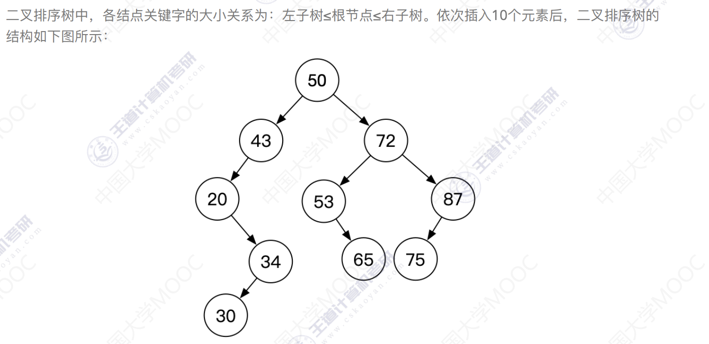
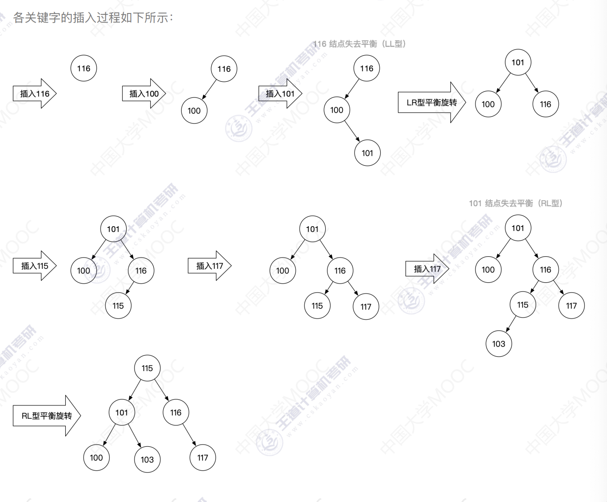

## 树和二叉树的应用

### 1 利用逐点插入法建立序列(50, 72, 43, 87, 75, 20, 34, 53, 65, 30)对应的二叉排序树。并求出这10个基于该二叉树的组织，在等概率情况下查找成功时的平均长度。

若查找的目标关键字位于树的第i层，则查找长度为l。因此在等概率情况下，查找成功的平均查找长度
ASL=(1 * 1 + 2 * 2 + 3 * 3 + 4 * 3 + 5 * 1)/10=31/10=3.1

### 2 将关键字序列{116, 100, 101, 115, 117, 103}依次插入到初始为空的平衡二叉树AVL树，给出每插入一个关键字后的平衡树，并说明其中可能包含的平衡调整步骤，即说明是哪个结点失去平衡，然后说明做了什么平衡处理；然后分别给出前序、中序、和后序遍历该二叉树的输出结果。

前序遍历 115 101 100 103 116 117
中序遍历 100 101 103 115 116 117
后序遍历 100 103 101 117 116 115

### 3 假设传输的数据包含5个字母A B C D E，字母出现的频率为A-20% B-10% C-30% D-25% E-15%，请构造哈夫曼编码及哈夫曼树。

霍夫曼编码为

A 00

B 010

C 11

D 10

E 011

### 4 对于一个字符集中具有不同权值的字符进行Huffman编码时，如果已知某个字符的Huffman编码为0101，对于其他无字符的Huffman编码，请分析说明
(1) 具有哪些特征的编码是不可能的
0, 01, 010三个编码不可能出现；以0101为前缀的编码也不可能出现

在哈夫曼树中，所有字符一定位于叶子结点上，因此各个分支结点所对应的编码是不可能出现的，即0, 01, 010，三个编码不可能出现；另外，叶子结点的下层不可能再出现其他结点，因此以0101为前缀的编码也不可能出现。

(2) 具有哪些特征的编码是一定有的

以1、00、011、0100为开头的编码一定会有

哈夫曼树的特性-所有分支结点的度必然是2，因此各个分支结点的另一侧肯定会挂有其他结点